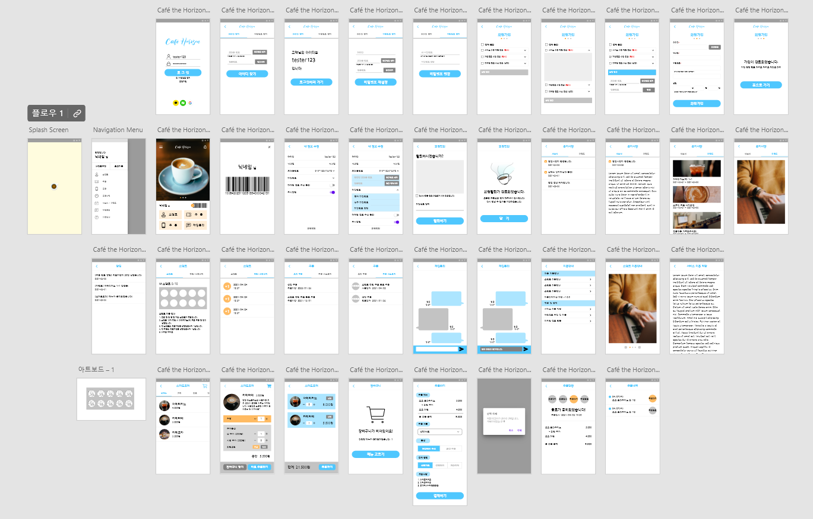

# 카페 수평선 Café Horizon 
  

## 프로젝트 소개

### 프로젝트 개요

가상의 카페를 위한 메뉴 안내 및 주문 어플입니다. 사용자는 언제든 어플을 통해 판매 중인 메뉴를 확인하고 주문할 수 있습니다. 누적 스탬프와 쿠폰 개수를 확인할 수도 있고, 원한다면 담당자에게 채팅 문의를 남길 수도 있습니다.

### 목업

최종 구현 결과물과는 다소 차이가 있습니다.

### 프로토타입

[프로토타입 보러 가기](https://xd.adobe.com/view/e0ff426c-32fe-4290-8e2b-b4cb6f93f98d-b5ac/?fullscreen)

Github에 업로드 된 코드는 각종 민감 정보(Firebase Key 등)가 누락되어 있어 실행이 어렵습니다.  
어플리케이션의 전체적인 흐름은 프로토타입과 아래의 캡처 이미지를 확인해주세요.
 
 

## 실행화면 및 사용 흐름

### 로그인

### 회원가입

### 메인 화면

### 스탬프 & 쿠폰

### 메뉴 확인 및 주문

### 채팅 문의

### 회원 정보 수정

### 공지, 이벤트, 이용 안내

## 개발 이슈

### 스플래시 화면

### 바코드 유일성 확보

### 소셜 로그인: 네이버와 카카오

### 서버의 부재

## 팀 정보
