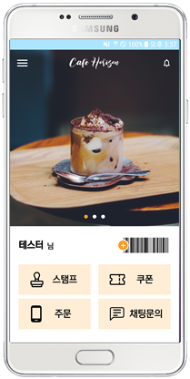
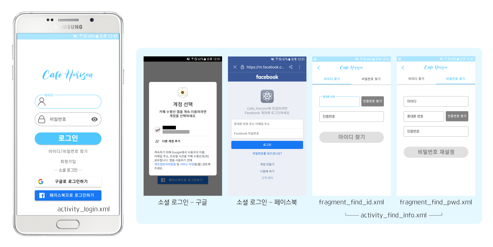

# 카페 수평선 Café Horizon 
  

## 프로젝트 소개

### 프로젝트 개요

가상의 카페를 위한 메뉴 안내 및 주문 어플입니다. 사용자는 언제든 어플을 통해 판매 중인 메뉴를 확인하고 주문할 수 있습니다. 누적 스탬프와 쿠폰 개수를 확인할 수도 있고, 원한다면 담당자에게 채팅 문의를 남길 수도 있습니다.

### 목업

최종 구현 결과물과는 다소 차이가 있습니다.

### 프로토타입

[프로토타입 보러 가기](https://xd.adobe.com/view/e0ff426c-32fe-4290-8e2b-b4cb6f93f98d-b5ac/?fullscreen)

Github에 업로드 된 코드는 각종 민감 정보(Firebase Key 등)가 누락되어 있어 실행이 어렵습니다.  
어플리케이션의 전체적인 흐름은 프로토타입과 아래의 캡처 이미지를 확인해주세요.
 
 

## 실행화면 및 사용 흐름

### 로그인

카페 수평선 어플은 반드시 로그인을 거쳐야만 사용할 수 있습니다. 자체 계정 로그인과 소셜 로그인을 모두 제공하며, 소셜 로그인으로는 구글과 페이스북 중 선택할 수 있습니다. 만약 기존에 자체 계정으로 가입한 회원이 소셜 로그인을 시도할 경우 기존 계정에 소셜 계정이 자동으로 연동됩니다.

모든 회원은 휴대폰 번호로 식별하게끔 되어있으므로, 만약 아이디나 비밀번호를 잊어버린 경우에는 번호 인증을 통해 계정을 찾을 수 있습니다. 비밀번호의 경우 보안 유지를 위해 기존 비밀번호는 제공하지 않고 재설정 기능만을 허용합니다.

### 회원가입

소셜 로그인을 사용하지 않고 카페 수평선 자체 계정을 생성하고자 할 경우 로그인 화면에서 회원가입을 신청할 수 있으며, 가입 단계는 크게 세 단계로 나뉩니다.

1. **약관 동의**: 가장 먼저 카페 수평선의 약관을 확인하고 동의해야 합니다. "필수"라고 기재된 항목에 모두 동의해야 다음 단계를 진행할 수 있습니다.

2. **본인 인증**: 휴대폰 번호로 본인 인증을 진행합니다. 문자로 수신한 인증번호를 바르게 입력하면 다음 페이지로 넘어갑니다. 만약 이미 가입한 회원의 번호일 경우 이를 알리는 메시지가 뜹니다.

3. **추가 정보 기입**: 아이디, 닉네임, 비밀번호 등 회원을 생성하고 관리하기 위한 정보를 기입합니다. 이때 아이디의 경우 중복 확인을 반드시 거쳐야 합니다. 생일은 생일 쿠폰을 발행하기 위한 정보로 필수 항목은 아닙니다.

### 메인 화면

로그인 후 볼 수 있는 메인 화면에는 가장 먼저 이벤트나 광고 등을 볼 수 있는 이미지 슬라이드가 출력됩니다. 아래로 회원의 닉네임과 바코드 보기 버튼이 있고, 이어서 가장 많이 사용되는 메뉴인 스탬프, 쿠폰, 주문, 채팅 문의 버튼이 자리합니다.

- **내비게이션 메뉴**: 우상단의 햄버거 버튼(≡)을 누르거나 화면을 스와이프하여 열 수 있습니다.

- **알림창**: 좌상단의 종 버튼을 통해 열 수 있습니다. 최근 한 달 사이의 알림을 모아 보여줍니다.

- **바코드 화면**: 매장에서 스탬프를 적립하거나 쿠폰을 사용하는 데 필요한 바코드. 회원마다 고유의 바코드를 가집니다.

### 스탬프 & 쿠폰

메인 화면의 버튼이나 내비게이션 메뉴를 통해 스탬프와 쿠폰을 확인할 수 있습니다. 두 페이지 모두 탭으로 구성되어 있으며, 보유 현황과 적립/사용내역을 확인할 수 있습니다. 각 페이지의 탭 화면 간에는 상단의 탭을 클릭하거나 좌우로 스와이프하여 이동할 수 있습니다.

### 메뉴 확인 및 주문

판매 중인 메뉴를 확인하거나 주문하려면 "주문" 메뉴를 선택합니다. 카테고리별로 어떤 메뉴가 있는지 확인할 수 있고, 아이템을 선택하여 해당 메뉴의 상세 정보를 확인하거나 원하는 수량과 옵션을 입력하고 주문할 수 있습니다. 메뉴는 바로 주문하기 외에도 장바구니 기능을 제공합니다. 장바구니에 담긴 물건이 있으면 상단바 좌측의 장바구니 아이콘 내부에 색이 채워집니다.

메뉴를 선택하고 주문하기를 누르면 주문하려는 메뉴의 목록과 함께 쿠폰 사용 여부, 포장 여부, 결제 방법을 선택할 수 있는 창이 뜹니다. 원하는 옵션을 선택하고 최종 결제까지 마치면 카페에 주문이 접수됩니다. 이후 해당 주문은 주문대기 - 주문접수 - 픽업대기 - 픽업완료 4단계로 처리됩니다. 현재 주문 중인 메뉴를 비롯해 모든 내역은 주문내역 페이지에서 확인할 수 있습니다.

### 채팅 문의

회원은 카페 영업시간에 한해 담당자에게 채팅 문의를 남길 수 있습니다. 텍스트와 사진 전송을 모두 지원하며, 사진의 경우 눌러서 확대 이미지를 볼 수도 있고 상단의 버튼을 눌러 다운받는 것도 가능합니다. 채팅마다 발신 시각이 표시되고 읽음 여부도 확인할 수 있습니다. 채팅 일자가 바뀔 경우 날짜 구분선도 추가됩니다.

카페 수평선 어플은 오직 현재 로그인한 회원과 카페 담당자 사이의 1:1 채팅만을 지원합니다.

### 회원 정보 수정

회원 정보를 수정하고 싶을 경우 내비게이션 메뉴의 "내 정보 수정"을 통해 현재 정보를 확인하고 수정할 수 있습니다. 아이디는 고유값으로 변경할 수 없고, 휴대폰 번호를 변경하고자 할 경우 새 번호로 인증을 다시 거쳐야 합니다. 생일은 쿠폰을 발행하기 위한 정보이기 때문에 악용을 방지하고자 연 1회까지만 변경을 허용합니다.

하단의 "회원탈퇴"를 통해 카페 수평선 탈퇴 과정을 진행할 수 있습니다. 회원은 먼저 유의사항에 동의하고, 현재 비밀번호를 재입력한 뒤, 탈퇴하기 버튼을 최종으로 누름으로써 서비스를 탈퇴할 수 있습니다. 탈퇴한 회원의 모든 정보는 즉시 삭제되며 복원이 불가능합니다.

### 공지, 이벤트, 이용 안내

_"스탬프 이용안내"에 사용된 이미지는 샘플 이미지입니다._

이외에 내비게이션 메뉴에서 공지사항(새소식/이벤트)을 확인하거나 카페 수평선 어플의 이용방법 설명(이용안내)을 확인할 수 있습니다. 회원가입 시 동의했던 약관의 상세 내용도 이곳에서 다시 확인할 수 있습니다.
 
 

## 개발 이슈

### 스플래시 화면
카페 수평선의 스플래시 화면은 SplashActivity를 별도로 사용하는 방식으로 구현되었습니다. 어플리케이션을 시작할 때 가장 먼저 실행되는 액티비티로 SplashActivity를 설정하였으며, 일정 시간 노출되는 것을 보장하기 위해 딜레이 함수를 함께 사용합니다. 단, 스플래시 이미지를 Theme으로 설정함으로써 시작 시 빈 화면이 뜨는 것을 방지하였습니다.
어플리케이션을 실행하면 SplashActivity에서 사용자의 로그인 상태를 확인합니다. 확인한 상태에 따라 아직 로그인하지 않았다면 로그인 화면을, 로그인한 상태라면 메인 화면을 다음 화면으로 띄워줍니다.

### 바코드 유일성 확보
바코드는 아이디나 전화번호 등의 정보와 마찬가지로 각 회원을 개별로 식별할 수 있는, 유일한 데이터여야 합니다. 따라서 처음에는 다른 데이터를 처리하는 것과 같은 방식으로 진행하려 했으나, 여러 문제로 인해 최종적으로 다음과 같은 방식으로 구현되었습니다.

#### 카이사르 암호 응용 - 휴대폰 번호 활용

- 휴대폰 번호에 일련의 코드를 적용하여 생성

- 휴대폰 번호는 사용자별로 반드시 유일하고 유일한 값에 카이사르를 적용한 결과 또한 유일하므로, 이 방법을 사용하면 바코드의 유일성을 확보할 수 있다.

- 회원이 등록된 전화번호를 변경할 때마다 바코드도 새로 생성하고 등록해줘야 한다.

### 소셜 로그인: 네이버와 카카오
초기 기획에서 추가하고자 계획했던 소셜 로그인 소스는 네이버와 카카오, 구글이었습니다. 이 중 Firebase에서 기능을 제공해주는 구글과 달리 네이버와 카카오 로그인은 직접 구현해주어야 했는데, 각 API를 Firebase와 연결하는 데에 문제가 생겨 결국 페이스북 로그인으로 대체해야 했습니다.

주요 문제는 Firebase Authentication은 JWT를 이용하는 반면 네이버와 카카오 로그인 API는 OAuth 2.0을 이용한다는 것. 서버를 구축하지 않고 Firebase를 BaaS로 사용하던 중이었기에 변환 과정을 구현하기 어려웠습니다.

만약 서버를 구축하여 키를 변환하는 기능을 구현한다면 아래처럼 진행되었을 것으로, 본 프로젝트에서 아쉬운 부분 중 하나입니다.

1. 먼저 요청 서비스(네이버 또는 카카오) 인증을 진행하여 토큰을 받아온다.

2. 인증 토큰을 사용하여 해당하는 서비스의 아이디를 얻는다.

3. 2에서 얻어온 아이디를 사용, AdminSDK로 Firebase 토큰을 생성하고 signInWithCustomToken으로 사용자를 등록한다. 이후의 Firebase 인증에는 이 토큰을 사용하도록 한다.
 

## 팀 정보
#### 오나현 [Github](https://github.com/onhyeon618)
#### 장혜진 [Github](https://github.com/jhj5897)
#### 이명주 [Github](https://github.com/mmmmjjj)
 
